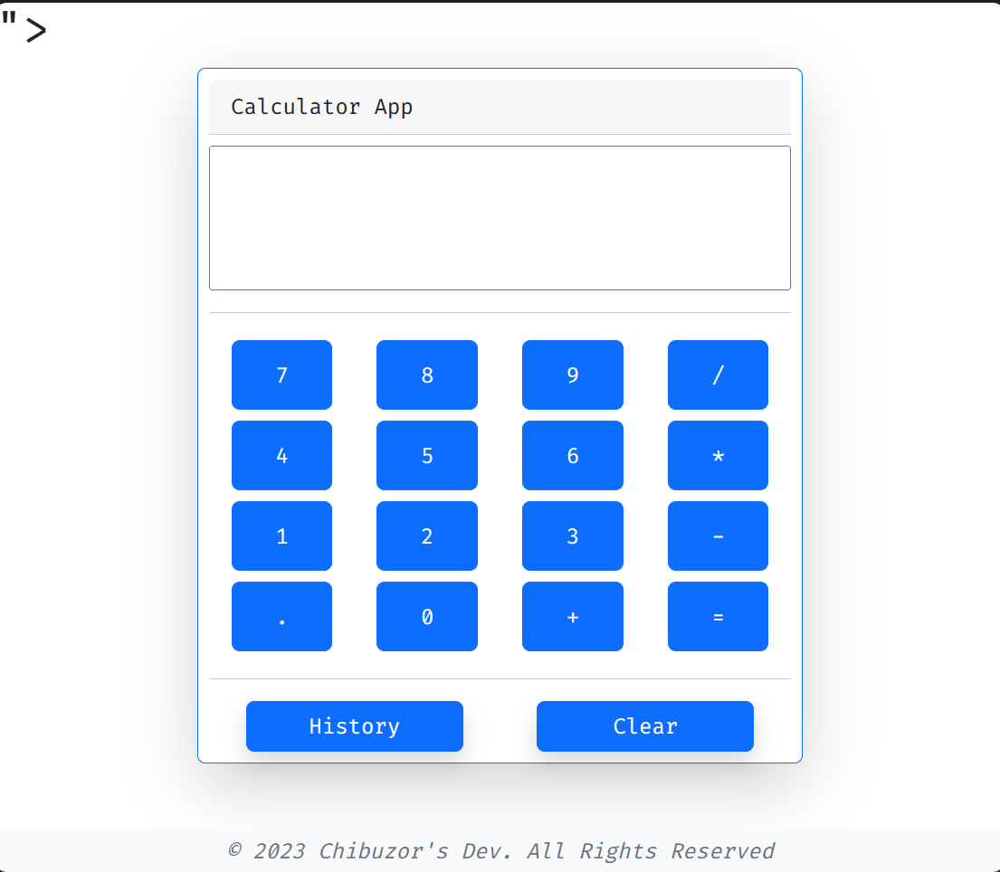

# Calculator App

## Overview

The Calculator App is a simple and user-friendly tool for performing basic mathematical calculations on your device. Whether you need to add, subtract, multiply, or divide, this app provides a straightforward solution for your mathematical needs.



## Features

- Basic arithmetic operations (addition, subtraction, multiplication, and division).
- Clear and intuitive user interface.
- History of calculations.

## Getting Started

To use the Calculator App, follow these simple steps:

1. Download and install the app on your device.
2. Launch the app from your device's home screen.
3. Use the on-screen keypad to input your mathematical expression.
4. Press the equal sign (=) to see the result.
5. You can clear the current input by pressing the "Clear" button or the entire history by pressing "History"

## Development

This app is built using Javascript, and you can find the source code in the [repository](https://github.com/chibuzor9/calculator-app). Feel free to explore the code, report issues, and contribute to its development.

### Installation

To run this app on your local development environment, follow these steps:

1. Clone this repository to your local machine.
   ```bash
   git clone https://github.com/chibuzor9/calculator-app.git
   ```
2. And your good to go

## Upcoming Features
- A responsive design where you can use this app everywhere and on all device. (Available only for desktops or landscape orientations)
- There will be an option to install the app as a PWA

## Problems or Bugs

You will experience bugs when trying to access your history after a calculation. But don't worry refresh and it shows. I'm still trying to fix the bug. Thank YOU 😊
